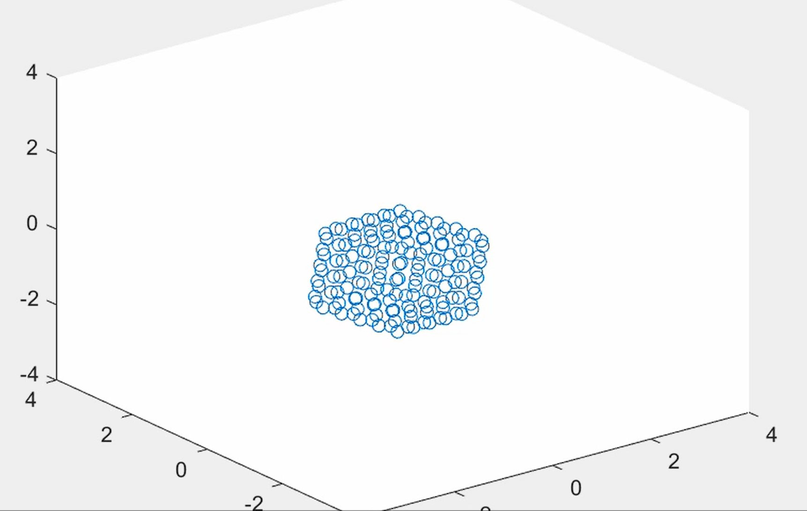

# Simulation of a Cubic Floating Body Suspended in Viscous Fluid

## Project Overview

This MATLAB simulation investigates the dynamics of a rigid cubic body interacting with a viscous fluid, using a discrete point mass approximation method.

## Key Methodology

- **Modeling Approach**: Represents the body as a surface-distributed set of point masses
- **Justification**: Mimics real-world hollow bodies like buoys, where mass is concentrated on the surface
- **Newtonian Considerations**: 
  - Contact forces applied only to surface points
  - Gravitational forces evenly distributed

## Computational Considerations

The simulation balances approximation accuracy with computational efficiency by varying the number of surface points relative to the body's size and mass.

